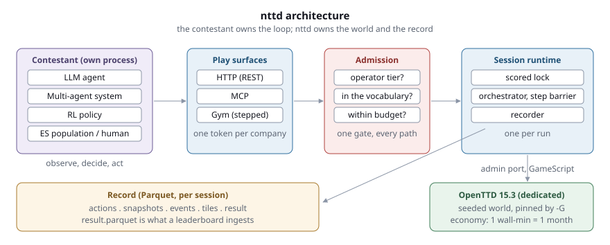
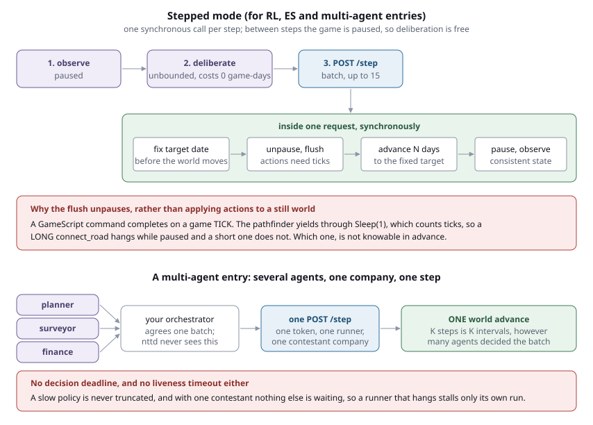
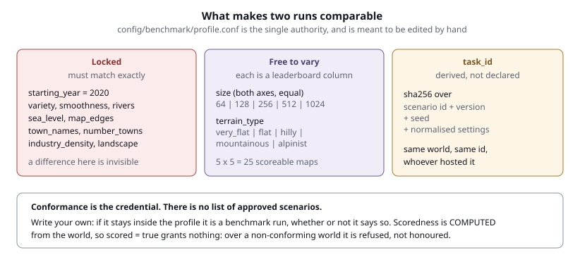
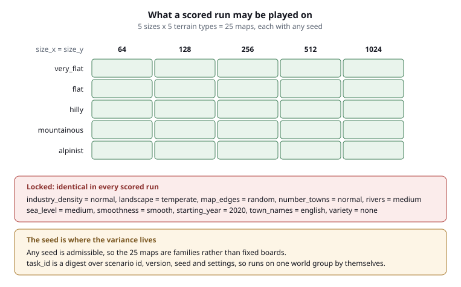
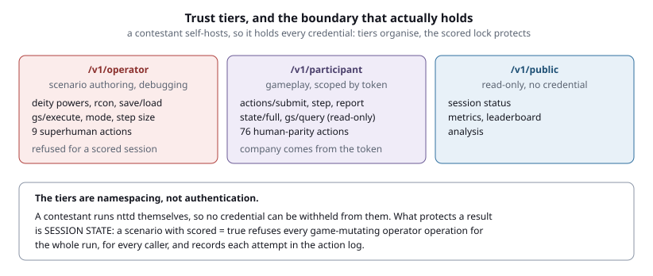

# nttd

**A benchmark for long-horizon planning, built on OpenTTD.**

An agent has to build a transport network that turns a profit: survey a map, pick
routes worth serving, lay track and roads, buy vehicles, set orders, and manage a
loan. Nothing about it is a single-turn problem — a decision made in the first game
month is still paying or costing you two game years later.

nttd wraps an OpenTTD 15.3 dedicated server and exposes the game as a structured JSON
API. It is agent-agnostic and framework-agnostic: **nttd does not run your agent.**
You bring the loop, in your own process, in whatever language and framework you like.
An LLM agent, a multi-agent system, an RL policy, an evolution-strategies population,
and a human all reach the game through the same surface and are recorded the same way.



---

## Three things worth knowing before anything else

**The scenario is the task.** It defines the world — map, seed, companies, end
conditions — and nothing about who plays it. The same scenario file is played by an
LLM agent, an RL policy, or a person.

**Your runner is the entry.** Which models, which prompts, which policy, which
framework: yours, and it lives with your code. nttd never needs to know.

**`result.parquet` is the record.** One row per scored company, written when the
session ends, carrying the score, the task identity, the code provenance, and what
the run was allowed to do. It is what a leaderboard ingests and what a verifier
checks.

---

## Install

Requirements: Python 3.13+, [uv](https://docs.astral.sh/uv/), and
[OpenTTD 15.x](https://www.openttd.org/downloads/openttd-releases/latest).

```bash
git clone git@github.com:deepsaia/nttd.git
cd nttd
uv sync                    # everything: server, CLI, analysis, RL, MCP, tests
```

Install OpenTTD, launch it once, and add **OpenGFX2 Classic** from Online Content.
`OpenSFX` and `OpenMSX` are optional. On macOS nttd looks for
`/Applications/OpenTTD.app/Contents/MacOS/openttd`; override with
`NTTD_OPENTTD_BINARY`.

Check your environment actually behaves the way nttd's design assumes:

```bash
uv run python -m scripts.verify_environment
```

That spawns real servers and takes a few minutes. It checks seed determinism, the
economy clock rate, engine availability, and the pause semantics the step barrier
depends on. Run it after upgrading OpenTTD.

---

## Running a benchmark

Every run is the same three steps: start the server, stand up a task, attach your
runner. What differs is the *runner*.

```bash
uv run nttd server                                             # terminal 1
uv run nttd benchmark --config config/benchmark/t2_example.conf # terminal 2
```

`benchmark` creates the session, generates the world, prints the participant token,
then waits for the end condition and writes the result. It does **not** run an agent —
attach yours to the printed session id while it waits.

If you would rather drive the lifecycle yourself:

```bash
uv run nttd session create --config config/benchmark/t2_example.conf
uv run nttd session start -s ses_... --agent-companies 1
uv run nttd session attach ses_...     # prints the token and the routes
# ... your runner plays ...
uv run nttd session stop -s ses_...
uv run nttd result -s ses_...
```

Validate a scenario before committing to a long run:

```bash
uv run nttd scenario validate config/benchmark/t2_example.conf
uv run nttd scenario profile            # the rules a scored scenario must satisfy
```

### The five kinds of experiment

Two examples of each. All of them use the same server and the same routes.

---

#### 1. Single LLM agent, real-time

The world runs continuously at 1 wall-minute per economy month. Your loop observes,
decides, and submits whenever it is ready.

**Example A — the smallest possible loop.**

```python
import requests

BASE, SID, TOKEN = "http://localhost:8000", "ses_...", "pt_..."
P = f"{BASE}/v1/participant/sessions/{SID}"
H = {"X-Participant-Token": TOKEN}

while True:
    state = requests.get(f"{P}/state/full", timeout=60).json()
    actions = my_policy(state)                    # your code
    for i, a in enumerate(actions[:15]):          # 15 per submission
        requests.post(f"{P}/actions/submit", headers=H, timeout=120, json={
            "action_id": f"a{i}", "action_type": a["action_type"],
            "parameters": a["parameters"], "company_id": 0,
        })
```

**Example B — with cost reporting, so the board can show what the run cost.**

```python
requests.post(f"{P}/report", headers=H, json={
    "nttd_framework": "langchain", "participant_type": "agent",
    "models": [{"model": "claude-opus-5", "prompt_tokens": 120_000,
                "completion_tokens": 8_000, "total_cost_usd": 3.91}],
})
```

nttd cannot observe tokens — you run the model, not nttd — so this is recorded as
*reported* and flagged as unverified. Action counts stay server-observed.

---

#### 2. Multi-agent system, real-time

Several loops sharing one company. They share its action ceiling too: scoring is per
company, so three loops must not get three times the actions of one.

**Example A — one token, several loops.** Every loop uses the same participant token,
because the token addresses a *company*. Coordination between them is your problem,
which is the interesting part.

**Example B — per-model spend, as a MAS actually spends it.** A front-man on a cheap
model plus specialists on expensive ones is a different system from the same total
spent uniformly, so report each separately. Repeated calls accumulate, so you can
report per cycle:

```python
requests.post(f"{P}/report", headers=H, json={
    "nttd_framework": "neuro-san", "participant_type": "mas",
    "models": [
        {"model": "claude-haiku-4.5", "role": "front_man",
         "prompt_tokens": 8_000, "total_cost_usd": 0.012},
        {"model": "claude-opus-5", "role": "route_planner",
         "prompt_tokens": 40_000, "total_cost_usd": 1.85},
    ],
})
```

`nttd result` then shows the breakdown per model and role.

Note the distinction from the next section: this is several loops cooperating as **one**
company. Several *competing* companies is `--agent-companies N`, one token each.

---

#### 2b. Several competing companies

`uv run nttd session start -s ses_... --agent-companies 2` creates two contestant
companies with one participant token each, in `participants.json`.

**Example A — real-time.** Nothing special: each company acts on its own cadence with its
own token. The ceiling and the score are per company, and observation is full state for
everyone, so nobody has an information edge. Using one company's token against another is
refused. The one shared resource is the GameScript: a rival issuing long `connect_rail`
calls will slow your submissions.

**Example B — stepped, from one process.** For self-play and population training:

```python
import json
from nttd.rl.multi_env import NttdParallelEnv

tokens = {int(k): v for k, v in json.load(open(f"logs/sessions/{SID}/participants.json")).items()}
env = NttdParallelEnv(session_id=SID, tokens=tokens)
observations, infos = env.reset()
observations, rewards, terminations, truncations, infos = env.step({
    "company_0": my_policy(observations["company_0"]),
    "company_1": [],                      # waiting is a legitimate move
})
```

Stepped play gathers each company's step into a shared **window**: the world advances once
per window, so K steps is K intervals whether one company plays or four. Without that, two
companies each taking one step advanced the world 60 days when staggered and 30 when
simultaneous, which would make a two-company run incomparable to a one-company one and
non-deterministic against itself.

There is no decision deadline, so a slow policy is never truncated; a company that goes
silent for 10 minutes is dropped and the rest carry on. For N independent policies in N
processes, use N `NttdEnv` instances and nothing else.

---

#### 3. RL, stepped

Real-time punishes a slow policy for being slow. Stepped mode does not: the game is
**paused between steps**, so deliberation costs zero game-days.



**Example A — through the Gym environment.**

```python
from nttd.rl.env import NttdEnv

env = NttdEnv(session_id="ses_...", token="pt_...")
obs, info = env.reset()
for _ in range(61):
    obs, reward, terminated, truncated, info = env.step(my_policy(obs))
    if terminated or truncated:
        break
```

The env holds no privileged access: it posts to the same participant routes an LLM
agent uses, so the ceiling, the scored lock, and the audit trail apply identically.
Reward is computed in the env from `info["snapshot"]`, not by nttd — what to optimise
is your choice, and a reward baked into the platform would have every entry
optimising nttd's opinion.

**Example B — the routes directly, if you would rather not use Gym.**

```bash
curl -X POST $P/step/reset -H "X-Participant-Token: $TOKEN"
curl -X POST $P/step -H "X-Participant-Token: $TOKEN" \
     -H 'Content-Type: application/json' \
     -d '{"actions":[{"action":"set_loan","params":{"amount":200000}}]}'
```

`/step` returns only after the world has advanced and been re-observed, so you never
have to guess when your actions took effect. Use
`config/benchmark/t2_stepped_example.conf`, which bounds the run in **steps** rather
than wall-minutes — wall time in stepped mode measures your hardware, not your play.

---

#### 4. Evolution strategies, stepped population

One session per candidate, all on the same seed so every candidate faces the same
world.

**Example A — sequentially.** Create, start, play, stop, repeat. Setup and teardown
measure about **13 seconds** per episode, against roughly 30 minutes of play for a T2
episode — so the overhead is not what limits you.

**Example B — concurrently.** Sessions are independent processes on their own ports,
so a generation parallelises. Four concurrent starts take about 8.6s against 33s
serial. What actually bounds an ES run is wall-clock play time, so parallelism is the
lever that matters.

---

#### 5. Human

A human is a first-class entry, ranked alongside the rest.

**Example A — join the running server.** `nttd session start` prints a
`game_port`; connect an OpenTTD client to `127.0.0.1:<port>` and play normally.

**Example B — for a comparable baseline**, play a scored scenario in real-time mode
and stop the session when the end condition fires. The result record is written the
same way, so a human row and an agent row on the same `task_id` are directly
comparable.

---

## What makes two runs comparable



`config/benchmark/profile.conf` is the single authority on what may be scored, and is
meant to be edited by hand. There is no list of approved scenarios: write your own, and
if it stays inside the profile it is a benchmark run.

**Scoredness is computed from the world, not declared in the file.** `scored = true` is
an assertion anyone could write above a world the profile would never admit, so it grants
nothing. A conforming scenario is scored whether or not it says so; `scored = false` is
an always-honoured opt-out; and `scored = true` over a non-conforming world is refused
rather than quietly downgraded.

A scored run may vary two things, giving **5 sizes × 5 terrain types = 25 maps**:



Maps must be **square**, because rectangles vary only the aspect ratio and would
multiply the board by five without adding a distinct problem. `landscape` is locked to
temperate for now: the four OpenTTD landscapes are separate economies, so each is really
its own benchmark.

The seed is where the variance lives. Any seed is admissible, so the 25 maps are families
rather than fixed boards. Runs are grouped by `task_id`, a digest over the scenario id,
version, seed, and normalised settings, so two people who independently describe the same
world land on the same `task_id` without coordinating.

Full detail in [play modes and scoring](docs/play_modes.md).

### Tiers fix time, not the world

The economy clock is fixed at 1 wall-minute per economy month and no OpenTTD 15.3
setting changes it, so wall-minutes *are* the economy horizon:

| Tier | Real-time | Economy horizon | |
|---|---|---|---|
| T1 | 15 min | ~1.25 game years | build-skill tier, largely pre-revenue |
| T2 | 30 min | ~2.5 game years | |
| T3 | 60 min | ~5 game years | economic performance becomes measurable |
| T4 | 120 min | ~10 game years | longer-running businesses |

Shipped examples: `t2_example.conf` (256×256 flat), `t3_example.conf` (512×512
hilly, 2 AI opponents), and `t2_stepped_example.conf` (the same world as T2, bounded
in steps).

---

## Trust boundaries



You self-host nttd, so you hold every credential. nttd does not pretend otherwise:

- **Tiers are namespacing.** `/v1/operator`, `/v1/participant`, `/v1/public` make it
  obvious which side of the boundary a route is on.
- **Tokens are addressing.** One per company. They answer "which company is this
  action for" in a form the caller cannot lie about — the company is derived from the
  token and overwrites anything in the request body.
- **The scored lock is the real protection**, because it is session state rather than
  a credential. A scored session refuses every game-mutating operator operation for
  its whole life, for every caller, and records each attempt.

A refused attempt does not void the run — nothing happened — but it is recorded, so
the result is no longer a *clean* run. That way an accident is visible without
destroying an otherwise legitimate two-hour session.

**Human parity** is the rule for the action vocabulary: an agent may do anything a
human can do through the GUI, and nothing more. Nine superhuman actions are
operator-only (`change_bank_balance`, `set_max_loan`, `found_town`, …), and twelve
capabilities that had been unreachable were opened up, including terraforming,
conditional orders, and cost estimation — the things that separate expert from novice
play.

---

## Commands

```
nttd server                 Start the API server
nttd benchmark              Stand up a benchmark task and wait for it to end
nttd session create         Create a session from a scenario
nttd session start          Generate the world and start OpenTTD
nttd session attach         Show the token and routes a runner needs
nttd session stop           Stop a session and write its result
nttd session list           List sessions
nttd session status         Show detailed session status
nttd scenario validate      Check a scenario without running it
nttd scenario profile       Show the rules a scored scenario must satisfy
nttd submit                 Package a session into a submission bundle
nttd verify                 Self-check a bundle before submitting it
nttd result                 Show the scored result record
nttd analyze                Generate analysis reports
```

Full API at `http://localhost:8000/docs` once the server is running.

---

## Documentation

| | |
|---|---|
| [Architecture](docs/architecture.md) | How the pieces fit, and why the boundaries are where they are |
| [Play modes and scoring](docs/play_modes.md) | Which worlds are scoreable, the two modes, and how a run is ranked |
| [CLI guide](docs/cli_guide.md) | Every command, with examples |
| [Agent guide](docs/agent_guide.md) | Writing a runner against the participant routes |
| [Session analysis](docs/session_analyzer.md) | Reading a completed run |

---

## Development

```bash
uv run pytest -q                          # 483 tests
uv run ruff check src/ tests/
uv run python scripts/generate_diagrams.py
```

The GameScript lives in `ottd_config/game/nttd-gs/main.nut`. It is loaded from the
per-session config directory, so editing it takes effect on the next session — no
rebuild.

Reference runners live in
[deepsaia/nttd-examples](https://github.com/deepsaia/nttd-examples). They are
contestant-side code and none of them import the `nttd` package: this repository ships
only the engine, `src/nttd`.

---

## License

Apache-2.0. The GameScript runs in-process against OpenTTD's GPL-2.0 API; see
`ottd_config/game/nttd-gs/` for its header.
