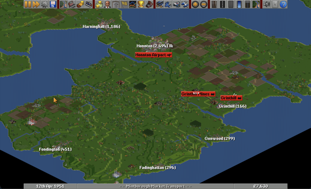
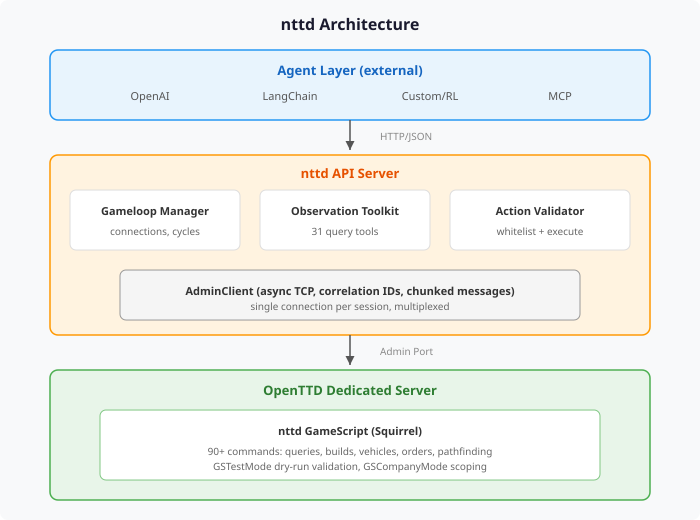
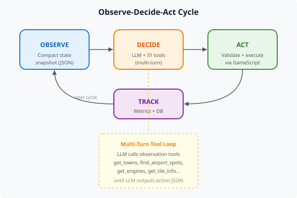
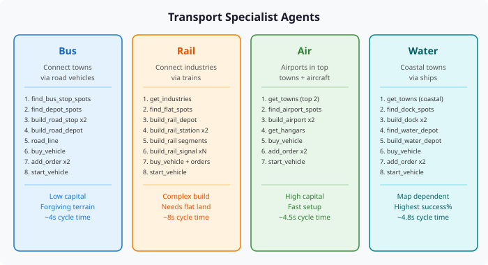

# Building and Benchmarking AI Agents That can Manage Large and Complex Business Empires

*An open benchmarking platform for multi-agent system evaluation in complex real-time environments*

---

## 1. Introduction

**OpenTTD** (open-source Transport Tycoon Deluxe) is a real-time strategy game requiring long-horizon planning, resource management, spatial reasoning, and economic adaptation. **nttd** wraps OpenTTD as an AI simulation environment: agents connect via HTTP/JSON, observe game state, and submit actions without touching OpenTTD internals.

<p align="center">
  
</p>

This report covers the architecture, the observe-decide-act gameloop, transport-specific agent design, and results from four test sessions: three single-agent baselines and one multi-agent cooperative session.

---

## 2. Project Goals

- **Multi-Agent Systems Research**: Test how specialized agents cooperate or compete while managing a shared business empire with shared capital, loan capacity, and reputation.
- **LLM Benchmarking with Controlled Variables**: Fix map seed, starting conditions, game speed, transport type, and system prompt to isolate model capability as the independent variable.
- **Open-Source and Small Model Evaluation**: Any model that generates structured output can be tested (Llama, Mistral, Qwen, quantized models, locally hosted models) via the agent-agnostic HTTP/JSON interface.
- **Prompt Engineering and Strategy Optimization**: System prompts are first-class configuration parameters. Researchers can modify prompts, tool-calling guides, and observation formats to find optimal configurations per model.
- **Hybrid AI Architectures**: The API supports combining LLM reasoning with classical algorithms (e.g., rule-based pathfinding paired with LLM strategic planning).
- **Reproducible Evaluation**: All cycle data is recorded to SQLite with session-level isolation. The leaderboard system computes cross-session rankings.
- **Human-AI Co-Play**: Agents and human players can operate in the same game, enabling research into human-AI teaming.

---

## 3. Architecture

<p align="center">
  
</p>

**Key decisions**: OpenTTD is the source of truth (no cached state). Agents are external clients conforming to published JSON schemas. GameScript handles 90+ commands including GSTestMode dry-run validation. One admin connection per session, multiplexed via correlation IDs. Each session spawns its own OpenTTD server process.

---

## 4. The Observe-Decide-Act Cycle

<p align="center">
  
</p>

1. **Observe**: Compact JSON snapshot scoped to the agent's company (~1ms GS round-trip).
2. **Decide**: Multi-turn tool calling. The Agent queries 31 observation tools until it commits to a final action list. Example: `get_industries` -> `find_flat_spots` -> `get_engines` -> submit build actions.
3. **Act**: Actions validated against a whitelist, executed via GameScript. Success/failure feeds back into conversation history.
4. **Track**: Each cycle records timing (observe_ms, decide_ms, execute_ms), action counts, and observation size to SQLite.

---

## 5. Transport Specialist Agents

Four transport-type-specific prompts encode domain expertise as strategy guides.

| Agent | Strategy | Key Characteristics |
|-------|----------|-------------------|
| **Road** | Connect nearby towns with buses | Lowest capital, forgiving terrain, easy fleet scaling |
| **Rail** | Connect industries via trains (coal to power, farm to factory) | Most complex: 10+ action sequence, contiguous track, signals required |
| **Air** | Build airports in largest towns, run aircraft | Simplest build (2 airports + 1 vehicle), highest capital cost |
| **Water** | Connect coastal towns via ships | Moderate complexity, dock needs specific coast orientation, ships are slow |

<p align="center">
  
</p>

---

## 6. Decision Complexity Spectrum

During a full gameplay session, agents face decisions ranging from simple single-command queries to multi-step strategic reasoning that spans dozens of actions and requires adapting to evolving game state. The table below illustrates this spectrum with representative examples across gameplay phases.

| Complexity | Category | Example Decision | What Makes It Hard |
|:----------:|----------|------------------|--------------------|
| 5 | Observation | Check company balance, loan amount | Single query, no side effects |
| 10 | Observation | List all towns sorted by population | Single query, interpret structured result |
| 15 | Observation | Scout tile terrain around a target industry | Multiple `get_tile_info` calls, spatial reasoning |
| 20 | Finance | Take out a loan / repay loan | One action, but must reason about cash flow timing |
| 25 | Build (road) | Place a bus stop in a town | Use `find_bus_stop_spots`, pick from results, one build action |
| 30 | Build (water) | Build a dock at a coastal town | Must understand coast tile orientation, use smart finder |
| 35 | Build (air) | Build an airport near a large town | Requires flat rectangular area of correct size for airport type, town authority approval |
| 40 | Route (road) | Connect two towns with a bus route | Build 2 stops + depot + road + buy vehicle + set 2 orders + start (~7 actions) |
| 45 | Fleet | Buy a vehicle, assign orders, start it | Choose correct engine for cargo type, set order sequence correctly |
| 50 | Route (water) | Connect two coastal towns with a ship route | Build 2 docks + water depot + buy ship + orders; depot must be on water tile (not coast), may need buoys for long distances |
| 55 | Route (air) | Establish an air passenger service | Build 2 airports (flat land + town approval) + buy aircraft + orders; highest single-infrastructure cost |
| 60 | Finance | Manage cash flow across concurrent builds | Multiple agents spending from shared balance; decide whether to take loan, delay a build, or scale back |
| 65 | Build (rail) | Lay track between two points | Multiple `build_rail` segments on compatible terrain, handle elevation changes, bridge over obstacles |
| 70 | Route (rail) | Full rail freight route: coal mine to power station | Depot + station + track segments + signals + station + buy train + attach wagons + orders + start (10-15 actions, sequentially dependent) |
| 75 | Optimization | Refit vehicles for different cargo, adjust orders | Requires understanding current cargo flows, profitability per route, available cargo types at connected industries |
| 80 | Network | Expand a rail network with junctions and shared track | Signal placement for safe multi-train operation, avoid deadlocks, plan junction geometry |
| 85 | Strategy | Decide which new route to build next | Weigh industry output vs. distance vs. terrain difficulty vs. available capital vs. competition from other agents |
| 90 | Maintenance | Diagnose and fix an unprofitable route | Identify why revenue is low (wrong cargo? too few vehicles? slow route?), decide whether to optimize, expand, or abandon |
| 95 | Multi-agent | Coordinate infrastructure across transport modes | Rail agent builds station near port so water agent's cargo transfers; requires understanding of the other agent's network and cargo flows |
| 100 | Long-horizon | Plan a 30-minute company growth strategy | Balance short-term revenue (buses) vs. long-term investment (rail network), manage loan lifecycle, respond to new industries appearing, adapt to town growth |

**Reading the table**: Lower scores are decisions an agent can make reliably today. Mid-range scores (40-70) are where current agents operate, with success rates of 70-85%. Higher scores (75+) represent decisions that require capabilities beyond what the current 5-minute test sessions exercise: multi-turn financial reasoning, network-level spatial planning, and cross-agent strategic coordination.

---

## 7. Smart Finder Tools: GSTestMode Dry-Run Validation

Early agent runs had high failure rates from selecting tiles that looked valid but failed OpenTTD's strict placement requirements. The solution: `GSTestMode()` dry-run validation.

The smart finders scan tiles around a target, attempt builds in test mode (no money spent, no side effects), and return only tiles that passed. This guarantees `find_airport_spots`, `find_dock_spots`, `find_water_depot_spots`, and `find_bus_stop_spots` return buildable coordinates.

```squirrel
local test = GSTestMode();
foreach (tile in candidates) {
    if (GSAirport.BuildAirport(tile, airport_type, GSStation.STATION_NEW)) {
        results.append({ tile = tile, x = GSMap.GetTileX(tile), y = GSMap.GetTileY(tile) });
    }
}
```

After introducing smart finders, failure modes shifted from "invalid tile" errors to higher-level issues (insufficient funds, wrong parameters), confirming the spatial reasoning bottleneck was resolved.

---

## 8. Experimental Setup

Four test sessions, all using GPT-5.2 on a 256x256 map with compact observation mode and ~100,000 starting capital.

| Parameter | Single-Agent Sessions | Multi-Agent Session |
|-----------|----------------------|---------------------|
| Session IDs | ses_423b (rail), ses_be86 (air), ses_4a48 (water) | ses_524399c17ed1 |
| Duration | ~5 minutes each | 5 minutes |
| Adapter | LangChain (rail, air), OpenAI (water) | OpenAI |
| Company | Exclusive | Shared by all 3 agents |

Single-agent sessions establish per-transport baselines. The multi-agent session tests cooperative operation on a shared company with shared capital and infrastructure.

---

## 9. Results

### 9.1 Performance Summary

| Metric | Rail (solo) | Air (solo) | Water (solo) | Multi-Agent (Rail+Air+Water) |
|--------|-------------|------------|--------------|------------------------------|
| Cycles | 17 | 28 | 14 | 114 |
| Total actions | 14 | 32 | 10 | 226 |
| Succeeded / Failed | 12 / 2 | 11 / 21 | 8 / 2 | 165 / 61 |
| **Success rate** | **85.7%** | **34.4%** | **80.0%** | **73.0%** |
| Avg decide time (ms) | 5,100 | 4,931 | 3,424 | 5,651* |
| Actions per cycle | 0.8 | 1.1 | 0.7 | 2.0 |
| Zero-action cycles | 52.9% | 42.9% | 71.4% | 21.9% |

*Multi-agent avg decide time weighted across rail (7,828ms), air (4,430ms), water (4,694ms).

### 9.2 Key Findings

**Conservative agents performed better solo.** Rail (85.7%) and water (80.0%) both used observation-heavy strategies with 53-71% zero-action cycles. When they did act, accuracy was high. The air agent attempted the most actions per cycle (1.1) but achieved only 34.4%, primarily from ignoring validated `find_airport_spots` results in favor of self-selected tiles.

**Multi-agent mode increased activity 2-3x.** Actions per cycle jumped from 0.7-1.1 (solo) to 2.0 (multi). Zero-action cycles dropped from 43-71% to 22%. The presence of other agents (visible through shared company state) may create implicit pressure to act.

**Decide time dominates (97-99% of cycle time).** GS execution is negligible (~100ms). Rail reasoning is slowest (7.8s multi-agent) due to complex multi-step planning. All agents showed occasional 20-24s spikes during extended tool-calling sequences.

### 9.3 Success Rate Over Time

**Single-Agent:**

| Phase | Rail | Air | Water |
|-------|------|-----|-------|
| Early (cycles 1-5) | 80.0% | 33.3% | 60.0% |
| Mid (cycles 6-10) | 83.3% | 42.9% | N/A (0 actions) |
| Late (cycles 11+) | 100.0% | 22.2% | 100.0% |

**Multi-Agent:**

| Phase | Rail | Air | Water |
|-------|------|-----|-------|
| Early (cycles 1-10) | 84.6% | 100.0% | 64.3% |
| Mid (cycles 11-20) | 71.4% | 59.4% | 100.0% |
| Late (cycles 21+) | 65.2% | 69.2% | 71.8% |

Rail and water improved to 100% in late solo phases, suggesting learning from conversation history. Air degraded (33% to 22%), failing to adapt. In multi-agent mode, rail declined as it attempted increasingly complex operations; air started perfect then dropped; water peaked mid-session after early exploration.

### 9.4 Multi-Agent Economics

Starting balance ~100,000; end balance 47,383; company value ~55-67K. Agents invested heavily in infrastructure but had not reached profitability within 5 minutes (expected, as routes need time to generate revenue). Zero crashes or exceptions across all 114 cycles.

---

## 10. Discussion

### 10.1 What Worked Well

- **Agent-agnostic design**: Swapping adapters (OpenAI, LangChain) required zero gameloop changes.
- **Multi-turn tool calling**: 2-3 tool calls before acting improved success rates vs. single-shot prompting.
- **GSTestMode validation**: Eliminated spatial placement failures entirely.
- **Transport-specific prompts**: Domain expertise prevented agents from wasting cycles on impossible builds.
- **Shared company operation**: Three agents, no explicit coordination, no conflicts. GS serialization handled concurrency.

### 10.2 Known Limitations

- **Rail complexity** (#1): 10+ action sequences cause the Agent to lose track mid-build.
- **Tile confusion** (#2): Agent occasionally uses coordinates from the wrong tool result.
- **No inter-agent coordination** (#4): Agents can build redundant infrastructure or drain shared capital.
- **No profitability feedback** (#5): Agents optimize for building, not revenue.
- **DB recording gaps** (#6): Cycle-level metrics recorded, but individual action details are not yet wired.

---

## 11. Future Directions

- **Inter-agent communication**: Shared message bus for explicit coordination.
- **Profitability-driven cycles**: Revenue/profit data in observations to shift from "build" to "optimize."
- **Competitive multi-company**: Different models on separate companies in the same game.
- **Longitudinal sessions**: 30-60 minute runs to assess sustained performance and profitability.
- **Public leaderboard**: Standardized benchmarks with community-submitted results.
- **Human-AI co-play**: Agents alongside human players for teaming research.

---

## 12. Reproducibility

```bash
# Start nttd API server
uv run uvicorn nttd.api.app:app --host 0.0.0.0 --port 8000

# Create and start a session
SESSION=$(curl -s -X POST http://localhost:8000/admin/sessions/new \
  -H "Content-Type: application/json" \
  -d '{"name": "multi-agent-test"}' | python3 -c "import sys,json; print(json.load(sys.stdin)['session_id'])")

curl -s -X POST "http://localhost:8000/admin/sessions/$SESSION/start" \
  -H "Content-Type: application/json" \
  -d '{"agent_companies": 1}'

curl -s -X POST "http://localhost:8000/sessions/$SESSION/mode?mode=async_realtime"
curl -s -X POST "http://localhost:8000/sessions/$SESSION/unpause"

# Register and start three agents
for AGENT in rail air water; do
  curl -s -X POST "http://localhost:8000/sessions/$SESSION/gameloop/agents/register" \
    -H "Content-Type: application/json" \
    -d "{\"agent_id\": \"${AGENT}-agent\", \"company_id\": 0, \"agent_type\": \"$AGENT\",
         \"adapter\": \"openai\", \"model\": \"gpt-5.2\"}"
  curl -s -X POST "http://localhost:8000/sessions/$SESSION/gameloop/agents/${AGENT}-agent/start"
done
```

```sql
SELECT agent_id, total_cycles, total_actions, successful_actions, failed_actions,
       ROUND(avg_cycle_ms, 1), ROUND(avg_decide_ms, 1)
FROM agent_connections WHERE session_id = 'SESSION_ID';
```

---

## 13. Conclusion

nttd demonstrates that OpenTTD serves as a rich evaluation environment for LLM-powered agents. The most notable finding: agents became 2-3x more active in multi-agent mode, with "analysis paralysis" cycles dropping from 43-71% to 22%. Whether this stems from implicit competitive pressure or from adapter/prompt improvements between sessions is a question for controlled follow-up experiments.

The platform's agent-agnostic design and structured metrics recording make it suitable for reproducible cross-model benchmarking in an environment where reasoning, planning, and spatial understanding directly translate to measurable performance.

---

*Built with nttd, an agent-agnostic API server for OpenTTD. Source at github.com/deepsaia/nttd.*
