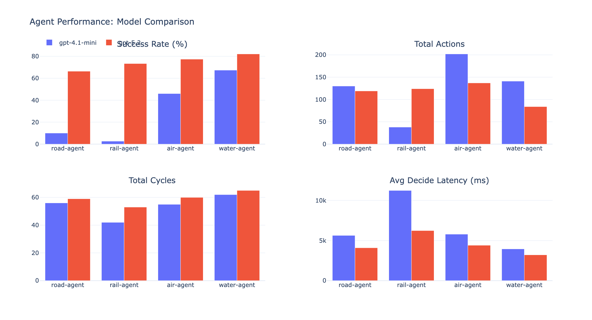
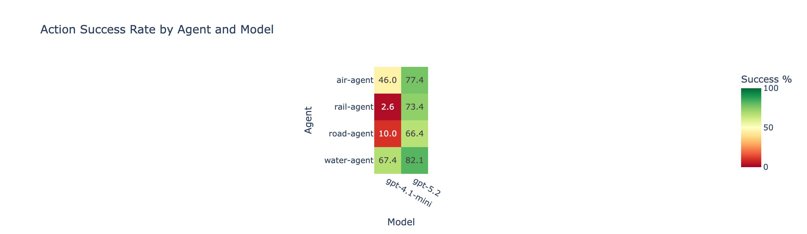
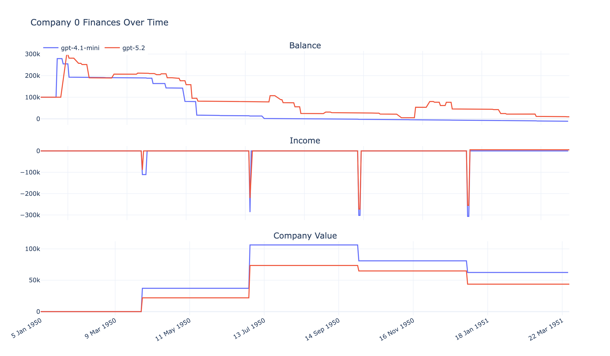
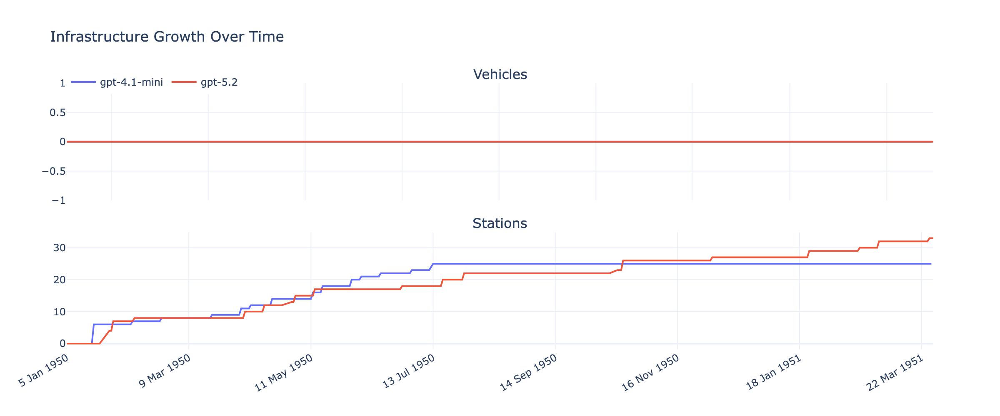
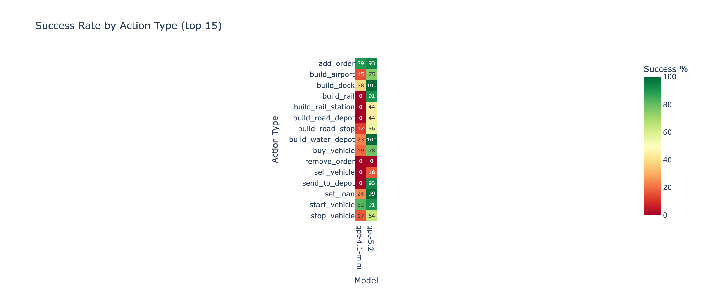
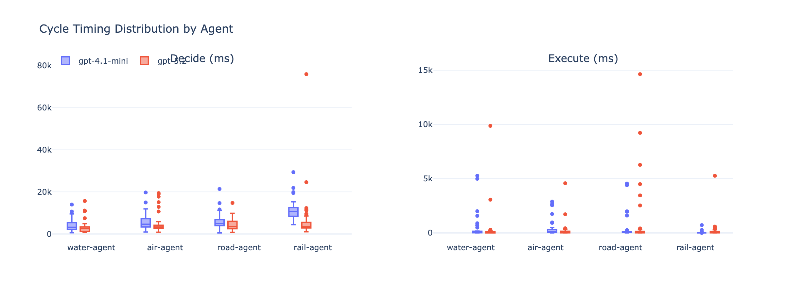
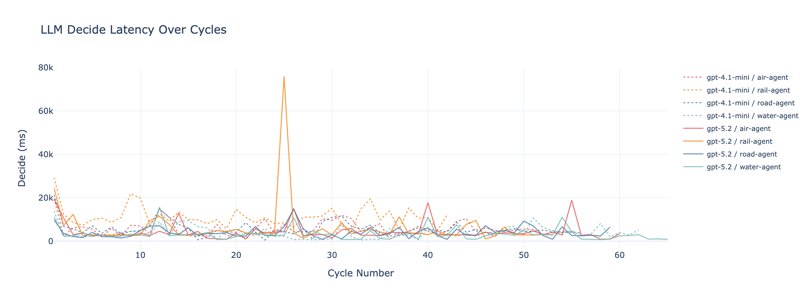

# Multi-Agent LLM Benchmarking in OpenTTD: Architecture and First Results

*An open platform for evaluating LLM-powered agents in a complex real-time strategy environment*

---

## 1. Introduction

**OpenTTD** (open-source Transport Tycoon Deluxe) is a real-time business simulation requiring long-horizon planning, spatial reasoning, resource management, and economic adaptation. **nttd** wraps OpenTTD as an AI evaluation environment: agents connect via HTTP/JSON, observe game state, and execute actions without touching OpenTTD internals.

<p align="center">
  
</p>

This report covers the system architecture, the agent gameloop, transport-specific agent design, and comparative results from two 15-minute multi-agent sessions pitting **GPT-4.1-mini** against **GPT-5.2** on cooperative company management.

---

## 2. Goals

- **Multi-agent cooperation research.** Four transport specialists share one company with shared capital, loans, and reputation. No explicit coordination protocol: agents observe shared state and must implicitly cooperate.
- **Controlled LLM benchmarking.** Fix map seed, starting conditions, game speed, and system prompts. The only independent variable is the model.
- **Open-model evaluation.** Any model producing structured JSON output can be tested (GPT, Claude, Llama, Mistral, Qwen, locally hosted) via the agent-agnostic HTTP API.
- **Prompt engineering research.** System prompts are first-class config. Researchers can vary prompts, tool-calling guides, and observation formats to find optimal configurations per model.
- **Reproducible metrics.** All cycle data (actions, timing, game state snapshots) is recorded to Parquet with session-level isolation. Analysis scripts produce standardized comparison plots.

---

## 3. Architecture

<p align="center">
  
</p>

**Key design decisions:**
- OpenTTD is the source of truth. nttd never caches game state.
- Agents are external HTTP clients conforming to published JSON schemas. No adapter code inside nttd.
- GameScript handles 90+ commands including `GSTestMode` dry-run validation.
- One admin TCP connection per session, multiplexed via correlation IDs with chunked message reassembly.
- Each session spawns its own OpenTTD server process with isolated config and data directories.
- Session data persists to HOCON config files (metadata) and Parquet (time-series). No database required.

---

## 4. Observe-Decide-Act Cycle

<p align="center">
  
</p>

1. **Observe**: Compact JSON snapshot scoped to the agent's company (~1ms GS round-trip).
2. **Decide**: Multi-turn tool calling. The agent queries observation tools until it commits to an action list. Example: `get_industries` -> `find_flat_spots` -> `get_engines` -> submit build actions.
3. **Act**: Actions validated against a type-specific whitelist, executed via GameScript. Success/failure feeds back into conversation history.
4. **Track**: Each cycle records timing (observe_ms, decide_ms, execute_ms), action counts, and observation size to Parquet.

Decide time dominates: 97-99% of each cycle is LLM reasoning. GS execution is ~100ms.

---

## 5. Transport Specialist Agents

Four agents encode transport-domain expertise as strategy guides in their system prompts.

<p align="center">
  
</p>

| Agent | Strategy | Build Complexity |
|-------|----------|-----------------|
| **Road** | Bus/truck routes between nearby towns | Low: stop + depot + road + vehicle (~7 actions) |
| **Rail** | Freight routes between industries | High: depot + stations + track + signals + vehicle (~12 actions) |
| **Air** | Airports in largest towns | Medium: 2 airports + aircraft (~5 actions), highest capital cost |
| **Water** | Ship routes between coastal towns | Medium: docks + water depot + ship (~7 actions), map dependent |

Each agent has a restricted action whitelist matching its transport type, preventing cross-domain interference.

---

## 6. Smart Finder Tools: GSTestMode Validation

Early agent runs had high failure rates from tiles that looked valid but failed OpenTTD's strict placement rules. The solution: `GSTestMode()` dry-run validation.

Smart finders scan tiles around a target, attempt builds in test mode (no money spent, no side effects), and return only validated coordinates. This covers `find_airport_spots`, `find_dock_spots`, `find_water_depot_spots`, and `find_bus_stop_spots`.

```squirrel
local test = GSTestMode();
foreach (tile in candidates) {
    if (GSAirport.BuildAirport(tile, airport_type, GSStation.STATION_NEW)) {
        results.append({ tile = tile, x = GSMap.GetTileX(tile), y = GSMap.GetTileY(tile) });
    }
}
```

After introducing smart finders, failure modes shifted from "invalid tile" spatial errors to higher-level issues (insufficient funds, wrong engine type), confirming the spatial reasoning bottleneck was resolved.

---

## 7. Decision Complexity Spectrum

Agents face decisions spanning simple single-command queries to multi-step strategic reasoning.

| Complexity | Example | What Makes It Hard |
|:----------:|---------|-------------------|
| 5-15 | Check balance, list towns, scout tiles | Single query, no side effects |
| 20-35 | Take loan, place bus stop, build dock | One build action, must select valid parameters |
| 40-55 | Full bus/ship/air route | 5-8 sequentially dependent actions |
| 60-70 | Rail freight route, manage shared cash flow | 10-15 actions, terrain reasoning, multi-agent capital contention |
| 75-90 | Network expansion, diagnose unprofitable route | Signal placement, revenue analysis, strategic pivots |
| 95-100 | Cross-agent coordination, long-horizon growth strategy | Requires understanding other agents' networks and planning across transport modes |

Current 15-minute sessions exercise the 40-70 range. Higher complexity requires longer sessions and inter-agent communication (future work).

---

## 8. Experimental Setup

Two 15-minute sessions on the same 256x256 temperate map. Four agents (road, rail, air, water) sharing a single company (company 0). Game speed 1x. Starting capital 100,000. Auto-stop via wall-clock end condition.

| Parameter | Session 1 | Session 2 |
|-----------|-----------|-----------|
| Session ID | ses_4771aa1e1fdb | ses_8608a9542696 |
| Model | GPT-4.1-mini | GPT-5.2 |
| Duration | 15.0 min | 15.1 min |
| Game time | ~15 months (Jan 1950 - Apr 1951) | ~15 months (Jan 1950 - Apr 1951) |
| Agents | 4 (road, rail, air, water) | 4 (road, rail, air, water) |
| Company | Shared (company 0) | Shared (company 0) |
| Adapter | LangChain | LangChain |

The only variable between sessions is the LLM model. Map seed, prompts, game settings, and observation format are identical.

---

## 9. Results

### 9.1 Aggregate Performance

| Metric | GPT-4.1-mini | GPT-5.2 |
|--------|-------------|---------|
| Total cycles | 215 | 236 |
| Total actions | 511 | 464 |
| **Overall success rate** | **39.5%** | **74.4%** |
| Final balance | -11,059 | +9,358 |
| Final company value | 62,381 | 43,763 |
| Final stations | 25 | 33 |

GPT-5.2 achieved nearly double the success rate with fewer total actions, indicating more deliberate decision-making.

### 9.2 Per-Agent Breakdown

<p align="center">
  
</p>

| Agent | GPT-4.1-mini | GPT-5.2 |
|-------|-------------|---------|
| Road | 13/130 (10.0%) | 79/119 (66.4%) |
| Rail | 1/38 (2.6%) | 91/124 (73.4%) |
| Air | 93/202 (46.0%) | 106/137 (77.4%) |
| Water | 95/141 (67.4%) | 69/84 (82.1%) |

<p align="center">
  
</p>

The most dramatic gap is rail: GPT-4.1-mini landed 1 of 38 rail actions (2.6%), while GPT-5.2 succeeded on 91 of 124 (73.4%). Rail requires the longest action sequences (depot, stations, track segments, signals, vehicle, orders), making it a natural discriminator of multi-step planning capability.

### 9.3 Financial Trajectory

<p align="center">
  
</p>

Both companies spent aggressively on infrastructure. GPT-5.2 maintained a positive balance through most of the session by managing loans effectively (96 loan actions, 99% success). GPT-4.1-mini's balance went negative, with only 24.4% success on loan management.

Neither company generated meaningful revenue within 15 months of game time. This is expected: OpenTTD routes need time for vehicles to complete trips and accumulate income. Longer sessions would better test the revenue generation phase.

### 9.4 Infrastructure Growth

<p align="center">
  
</p>

Both sessions built stations steadily (25 and 33 by session end). Vehicle counts stayed at zero in final snapshots, suggesting vehicles were bought and sold within snapshot intervals or builds failed before vehicles could persist.

### 9.5 Action Type Distribution

<p align="center">
  
</p>

**GPT-4.1-mini** top actions: `add_order` (89.4%), `build_road_stop` (12.2%), `start_vehicle` (81.8%), `buy_vehicle` (19.0%). High order-management success but very low infrastructure build success.

**GPT-5.2** top actions: `set_loan` (99.0%), `stop_vehicle` (64.2%), `start_vehicle` (91.1%), `send_to_depot` (93.2%). More fleet management actions, indicating GPT-5.2 progressed further into the operational phase beyond just building.

### 9.6 Cycle Timing

<p align="center">
  
</p>

<p align="center">
  
</p>

| Metric | GPT-4.1-mini | GPT-5.2 |
|--------|-------------|---------|
| Road avg decide | 5,634 ms | 4,089 ms |
| Rail avg decide | 11,242 ms | 6,237 ms |
| Air avg decide | 5,791 ms | 4,407 ms |
| Water avg decide | 3,952 ms | 3,211 ms |

Rail reasoning is consistently the slowest across both models due to complex multi-step planning. GPT-5.2 is 20-45% faster per cycle while achieving 2-28x higher success rates, suggesting more efficient tool use rather than longer deliberation.

---

## 10. Key Findings

1. **Model capability is the dominant factor.** Same prompts, same map, same tools. GPT-5.2 achieved 74.4% vs 39.5% success rate. The gap is widest on the hardest task (rail: 73.4% vs 2.6%).

2. **Rail is the hardest benchmark.** Its 10-15 action sequences with strict spatial constraints make it a natural discriminator of multi-step planning capability.

3. **Faster does not mean shallower.** GPT-5.2 was both faster (20-45% lower decide latency) and more accurate, ruling out a speed-accuracy tradeoff.

4. **Financial management differs qualitatively.** GPT-5.2 actively managed loans (96 actions, 99% success) and fleet lifecycle (sell, stop, send_to_depot). GPT-4.1-mini focused on building without operational management.

5. **15 months is pre-revenue.** Neither company reached sustained profitability. Routes need game time for vehicles to travel and accumulate income. Longer sessions (30-60 min) are needed to evaluate economic reasoning.

6. **Implicit cooperation works at this scale.** Four agents on shared capital, no coordination protocol, zero conflicts. GS serialization handles concurrency, and agents naturally diversified across transport types.

---

## 11. Limitations

- **Session length.** 15 minutes covers infrastructure building but not the revenue optimization phase.
- **No inter-agent communication.** Agents cannot explicitly coordinate, leading to potential redundant infrastructure.
- **Two-model comparison.** Broader model coverage (Claude, Llama, Mistral, Qwen) is needed for generalizable conclusions.
- **Single map.** Results may vary with different terrain, town layouts, and industry placement.
- **No profitability signal in prompts.** Agents optimize for building, not revenue. Adding financial feedback to observations could shift behavior.

---

## 12. Future Directions

- **Longer sessions** (30-60 min) to test revenue generation and sustained economic reasoning.
- **Broader model benchmarks** across open and closed models with standardized comparison plots.
- **Inter-agent messaging** for explicit coordination (e.g., rail agent requests dock placement from water agent).
- **Competitive multi-company** mode: different models on separate companies in the same game.
- **Profitability-driven observations** with revenue/cost data to shift agent behavior from building to optimizing.
- **Frontend observability** with interactive session analysis and multi-session comparison dashboards.

---

## 13. Reproducibility

```bash
# Start server with scenario config
nttd session create --config config/scenario.conf --name "4agent-benchmark"
nttd session start <SESSION_ID> --agent-companies 1

# Register four agents on shared company
for AGENT in road rail air water; do
  curl -s -X POST "http://localhost:8000/sessions/$SESSION/gameloop/agents/register" \
    -H "Content-Type: application/json" \
    -d "{\"agent_id\": \"${AGENT}-agent\", \"company_id\": 0, \"agent_type\": \"$AGENT\",
         \"adapter\": \"langchain\", \"model\": \"gpt-5.2\"}"
  curl -s -X POST "http://localhost:8000/sessions/$SESSION/gameloop/agents/${AGENT}-agent/start"
done

# Session auto-stops when end conditions are met.
# All data persists to logs/sessions/<session_id>/
```

**Analyze results:**

```bash
python scripts/analyze_sessions.py <session_id_1> <session_id_2> --output reports/comparison
```

Generates 13 interactive Plotly plots (HTML + PNG) covering agent performance, finances, action distributions, cycle timing, and more.

---

## 14. Conclusion

nttd provides a controlled, reproducible environment for evaluating LLM agents on complex multi-step planning tasks. The core finding from these first comparative sessions: **model capability is the primary determinant of agent performance**, with GPT-5.2 nearly doubling GPT-4.1-mini's success rate using identical prompts, tools, and game conditions. Rail transport, requiring the longest coherent action sequences, serves as the sharpest discriminator.

The platform's agent-agnostic design, file-based session recording, and automated analysis pipeline make it ready for broader model benchmarks and longer-horizon evaluation of economic reasoning.

#### Sidenote:
15 minutes is too short of a run. At game speed 1x, 15 real minutes covers roughly 15 in-game months. In OpenTTD, even a simple bus route needs:
  1. Vehicle to travel between stops (can take 1-3 game months depending on distance)
  2. Pick up passengers (accumulate over time at stops)
  3. Deliver and collect payment
  4. Repeat several trips to see meaningful income in snapshots

So the agents are stuck in the "infrastructure investment" phase. A 30-60 minute session (covering 2.5-5 game years) would let routes mature, vehicles complete multiple trips, and give agents a chance to react to revenue data and optimize. That would also test the higher end of the complexity spectrum: route profitability analysis, network optimization, and long-horizon capital allocation.

---

*Built with nttd. Source at github.com/deepsaia/nttd.*
