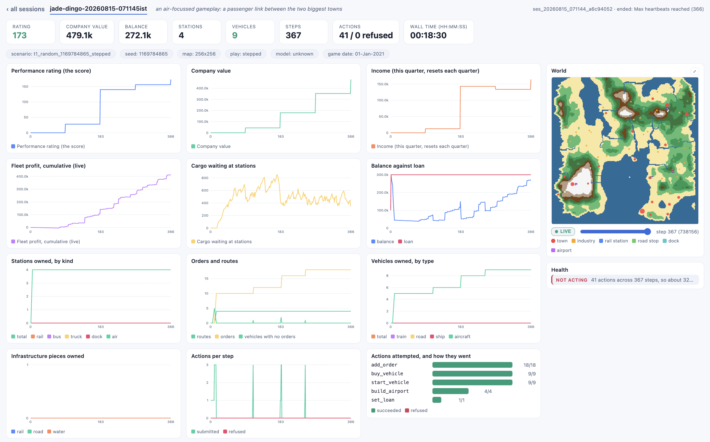

# Session Analyzer

Modular analysis system for nttd session data. Generates reports from parquet
files, renders to terminal/markdown/PNG/JSON, and serves data via API.

## Architecture

```
src/nttd/analysis/
    loader.py              -- SessionData, load_session(), fragment support
    date_utils.py          -- OpenTTD game date conversions
    plots.py               -- reusable Plotly visualization functions
    score.py               -- score_company(), the rating as the game computes it
    trajectory.py          -- per-day rows for a company, read from snapshots
    reports/
        registry.py        -- ReportResult, @register decorator, run_reports()
        renderer.py        -- render_markdown(), render_plots(), render_json()
        terrain_palette.py -- shared colours for the terrain images
        session_summary.py -- Session overview (config, duration, agents)
        financial.py       -- Company finances (balance, income, loan, infra costs)
        cargo_delivery.py  -- Cargo and transport mode revenue
        cargo_routes.py    -- Cargo flow per route, delivery counts
        cargo_distances.py -- Delivery distances by cargo type
        vehicle_fleet.py   -- Vehicle roster, profits, type breakdown
        infrastructure.py  -- Build actions, stations, depots
        stations.py        -- Per-station cargo waiting, acceptance and supply
        route_completion.py -- Route build success/failure, profitability
        events_timeline.py -- Chronological game events
        action_analysis.py -- Action type distribution, failure patterns
        orders.py          -- Vehicle orders, routes
        world_state.py     -- Towns, industries, subsidies, cargo flows
        tile_map.py        -- Terrain heatmap from tile data
        video.py           -- Terrain timelapse, falling back to screenshots
```

## Data Sources

All data lives in `logs/sessions/<session_id>/`:

| File | Content |
|------|---------|
| `session.parquet` | Session metadata, settings, timestamps (single-row) |
| `actions.parquet` | Action history (type, status, agent, error) |
| `result.parquet` | One row per scored company, with reported per-model spend |
| `events.parquet` | Game events (session_start, agent_start/stop) |
| `snapshots.parquet` | Full game state snapshots (companies, vehicles, towns, etc.) |
| `tiles.parquet` | Terrain data (height, slope, water/coast/buildable flags) |
| `spend.parquet` | Contestant-reported model usage, as it was reported |
| `screenshot/` | PNG screenshots, only when the screenshot timelapse is enabled |
| `save/` | `final.sav`, written at session end in every mode, plus OpenTTD's own autosaves |
| `submission/` | The bundle `nttd package` assembles, with a digest over each artifact |
| `_fragments/` | In-progress session data (auto-merged on stop) |

`final.sav` is the load-bearing one. A result says a company scored 812; the savegame is what
lets somebody else reload the world and get 812 back, which is why verification reads it and
why it is confirmed with `openttd -q` rather than by checking the file is non-empty.

The loader uses polars for fast parquet I/O and supports reading from
`_fragments/` when merged files don't exist yet (in-progress sessions).

## Reports

Each report module exposes a `generate(sessions)` function that returns a
`ReportResult` with structured data, Plotly figures, and markdown text.

All reports include a **period header** showing the game date range (date_from,
date_to, total_days). This is injected automatically by `run_reports()` into the
markdown (blockquote after the title), JSON (`data["period"]` dict), and plot
subtitles. Year-boundary metrics (last_year, total) only appear after a full
game year has elapsed.

| Report | Key Metrics | Figures |
|--------|-------------|---------|
| `session_summary` | Config, duration, agent list | Overview table |
| `financial` | Balance, income (this_year/last_year/total), loan, infra costs | 2 timeseries |
| `cargo_delivery` | Vehicle profits by transport mode (this_year/last_year/total) | Transport finances |
| `vehicle_fleet` | Vehicle roster, profit ranking (this_year/last_year/total) | Entity growth |
| `infrastructure` | Build counts by type/agent | 2 charts |
| `stations` | Per-station cargo waiting, acceptance and supply | 1 chart |
| `events_timeline` | Chronological events | Timeline scatter |
| `action_analysis` | Action types, top errors | 3 charts |
| `orders` | Order chains, routes, per-vehicle profits (this_year/last_year/total) | -- |
| `route_completion` | Route build success/failure, profitability | -- |
| `cargo_routes` | Cargo flow per route, delivery counts | -- |
| `cargo_distances` | Delivery distances by cargo type | -- |
| `world_state` | Towns, industries, subsidies, cargo | -- |
| `tile_map` | Terrain height, water %, town/station overlay | Heatmap |
| `video` | Terrain timelapse of the run, written only with `--video` | -- |

## CLI Usage

The session is an OPTION, `--session` or `-s`, not a positional argument. It takes a session id
or a path to a session directory.

```bash
# Print all reports to terminal (default -- no files saved)
nttd analyze -s 20260815-132431ist-quiet-pickle

# Print specific reports
nttd analyze -s 20260815-132431ist-quiet-pickle -r session_summary,financial

# Print as JSON
nttd analyze -s 20260815-132431ist-quiet-pickle --json

# Save to files
nttd analyze -s 20260815-132431ist-quiet-pickle --save markdown,png
nttd analyze -s 20260815-132431ist-quiet-pickle --save markdown,png,json,html

# Custom output directory
nttd analyze -s 20260815-132431ist-quiet-pickle --save png -o results/

# Generate the terrain timelapse. The video is a REPORT, so it is asked for by name;
# --video-quality, --video-fps and --video-max-frames tune it.
nttd analyze -s 20260815-132431ist-quiet-pickle -r video --video-quality medium --video-fps 8

# Compare multiple sessions
nttd analyze -s 20260815-132431ist-quiet-pickle --compare 20260815-141207ist-brisk-otter,20260815-152244ist-jade-heron

# Open saved report in browser
nttd analyze -s 20260815-132431ist-quiet-pickle --save markdown --open
```

## The Monitor

Everything above is offline: `nttd analyze` reads a session and produces reports. The same
files also feed a live reader. `nttd monitor` renders them as a page while they are still being
written, which is the part the reports cannot do, because a report is read after the fact and a
run that is going wrong is worth catching while it runs.

```bash
uv run nttd monitor            # then open http://127.0.0.1:4281
```



One page lists every session; one page shows a session in full. On a session page you get:

| | |
|---|---|
| **Headline chips** | Company value, balance, rating, stations, vehicles, days, actions with the refused count, reported cost, and wall time. Under them a strip of what the run is: scenario, seed, map size, play mode, model and the current game date. |
| **Charts, over game days** | Rating, company value, income, cumulative fleet profit; cargo waiting against cargo delivered; balance against loan; stations by kind; orders and routes with a count of vehicles that have none; vehicles by type; infrastructure pieces; and actions submitted against actions refused. |
| **World** | A top-down map plotted from the snapshots, with towns, industries and each kind of station, a scrubber over the run's days, and a LIVE toggle that follows the newest one. |
| **Health** | Named rules with the evidence that tripped each one, so a run that has stopped delivering says so while there is still time to look. |
| **Logs** | The fleet worst earner first, actions grouped by type with how each fared, the action log newest first, and the game's own events. |
| **Reported spend** | Cost and tokens over the run, with turn boundaries marked, and a per-model table. This is what the contestant declared through `/report`: nttd runs no model, so it records the claim rather than measuring it, and an empty cost chip is the absence of a claim rather than a zero. |

The flags, and the full list of health rules, are in
[the CLI guide](cli_guide.md#nttd-monitor).

### Where each figure comes from

Three different kinds of number sit on the same page, and telling them apart matters more than
any individual definition. Some are the game's own, some are nttd's arithmetic over snapshots,
and one is a claim nttd has no way to check.

**Read from the game, unaltered.** These are whatever the GameScript put in the snapshot, and
nttd neither recomputes nor adjusts them.

| figure | the game's field | note |
|---|---|---|
| Company value | `value` | Assets minus loan plus cash, where assets count vehicles at one and a half times their current value. A company that owes more than it owns floors at exactly **1**, which is a real answer and not a rounding error. Drawing a loan does not raise it, because the loan is subtracted again. |
| Rating | `performance_rating` | OpenTTD's own 1000-point score, nine capped components. |
| Balance, loan | `money`, `loan` | |
| Currency | | The game's money is reported in internal units and nttd does not convert it. `ottd_config/openttd.cfg` selects the custom currency at `rate = 1` with a `$` prefix, so OpenTTD's own display and these numbers are the same number: an opening balance reads 100,000 in the API and $100,000 in the game. Changing the setting would move only the game's display, not anything recorded, and any rate other than 1 would make the two disagree. |
| Income | `income` | The last COMPLETED quarter, held flat until the next one closes. Measured across three runs it changes on days 91, 182, 274 and 366 and nowhere else, and it can go DOWN, so it is neither the quarter in progress nor a running total. It says nothing about the last few days, which is why cumulative fleet profit exists beside it. |
| Cargo delivered | `cargo_delivered_total` | Banked across the quarter resets by the GameScript, so it only goes up. |
| Stations, vehicles | list lengths | |

[The gameplay guide](gameplay_guide.md#1-the-score-is-not-how-big-is-your-company) has the
component-by-component breakdown of the rating and the source lines that compute both it and
company value.

**Derived by nttd, from the same snapshots.** Each of these exists because the raw field
answers a slightly different question than the one being asked.

| figure | how it is arrived at |
|---|---|
| Day | The snapshot's game date minus the date the run opened on. NOT the row number: a day the runner acted on twice is captured twice, so a 366 day run can have 378 rows, and an axis of row positions labelled "day" disagrees with the scored result. |
| Reported cost and tokens | Plotted PER DAY, not cumulative, so a turn that cost four times the last one is four times the height rather than a slightly steeper piece of one climb. Zero on a day no turn ended is the true answer rather than a gap. The totals are in the per-model table underneath. |
| Fleet profit, cumulative | Each vehicle's `profit_this_year` summed, plus the totals banked at every game-year boundary. `profit_this_year` resets on 1 January and a one-year run ENDS on 1 January, so the live sum alone reads near zero on the final snapshot: measured 174,449 on 30-Dec-2020 and -20 the next step. Banked on the YEAR changing rather than on the sum dropping, because a sold or crashed vehicle also drops it and that would count its earnings twice. |
| Cargo waiting | Summed across every station. Read against cargo delivered on the same plot: waiting climbing while delivered stays flat is a network that collects and does not move. |
| Routes, orders, vehicles with no orders | Counted from each vehicle's order list. A vehicle with no orders is the failure a clone produces: it inherits the order list but arrives stopped, so it sits earning nothing while looking correctly configured. |
| Stations by kind, vehicles by type, infrastructure pieces | Classified per entity from the snapshot. |
| Actions, refused | From `actions.parquet`, matched to the snapshot by game date. |
| Wall time | Clock time, not game time, and not a measure of anything the run is scored on. |

**Reported by the contestant, and unverifiable.** Cost, tokens and the model name come from
what the runner declared through `/report`. nttd runs no model, so it records the claim rather
than measuring it, and an empty cost chip is the absence of a claim rather than a zero. Nothing
on the leaderboard ranks on it.

## API Endpoints

The analysis API serves the same report data as the CLI, for frontend consumption.

Served on the **public** tier, so the paths carry that prefix: the router is mounted under
`/v1/public` and adds `/analysis` of its own.

```
GET /v1/public/analysis/{session_id}/reports
    Returns: {"session_id": "...", "reports": ["session_summary", ...]}

GET /v1/public/analysis/{session_id}/report/{report_name}
    Returns: {"name": "...", "title": "...", "data": {...}, "figures": [...], "markdown": "..."}
    Query: ?compare=20260815-141207ist-brisk-otter,20260815-152244ist-jade-heron

GET /v1/public/analysis/{session_id}/report/{report_name}/plot/{plot_name}
    Returns: PNG image (or HTML with ?fmt=html)
    Query: ?compare=20260815-141207ist-brisk-otter,20260815-152244ist-jade-heron
```

## Adding a New Report

1. Create `src/nttd/analysis/reports/my_report.py`
2. Use the `@register("my_report")` decorator on a `generate()` function
3. Add the import to `ensure_reports_loaded()` in `registry.py`

```python
from nttd.analysis.loader import SessionData
from nttd.analysis.reports.registry import ReportResult, register


@register("my_report")
def generate(sessions: list[SessionData]) -> ReportResult:
    data = {"key": "value"}
    md = "# My Report\n\nContent here."
    return ReportResult(
        name="my_report",
        title="My Report",
        data=data,
        figures=[],
        markdown=md,
    )
```

Reports should be agent-agnostic. Don't hardcode agent names or types.
Iterate over whatever agents and actions exist in the session data.

## ReportResult

```python
@dataclass
class ReportResult:
    name: str                                  # Registry key
    title: str                                 # Human-readable title
    data: dict[str, Any] = ...                 # JSON-serializable for frontend
    figures: list[tuple[str, go.Figure]] = ... # (name, plotly figure) pairs
    markdown: str = ""                         # Rendered markdown text
    files: list[tuple[str, Path]] = ...        # (name, path) for artifacts on disk
```

- everything after `title` defaults to empty, so a report returns only what it has
- `data` should be JSON-serializable (no numpy arrays, no DataFrames)
- `figures` are Plotly Figure objects, rendered to PNG/HTML by the renderer
- `markdown` is printed to terminal and saved to `report.md`
- `files` is for a report whose output is a file rather than a figure, which is how the
  `video` report returns the timelapse it wrote

## Dependencies

All declared in the main dependency list rather than behind an extra, so `nttd analyze` works
on a plain `uv sync`.

- **polars** -- fast parquet I/O (used by loader)
- **pyarrow** -- parquet writing on the recorder side
- **plotly** -- interactive charts
- **pandas** -- imported by `plots.py`
- **kaleido** -- static PNG export from Plotly
- **imageio[pyav]** -- video generation. The `pyav` extra rather than plain imageio, because
  the video report imports `av` directly
- **pillow** -- imported by `reports/video.py`

`pandas` and `pillow` are declared for the same reason: both were reaching the environment
only as somebody else's transitive dependency, and an undeclared dependency that happens to be
present is a working install by luck. Removing seaborn broke `nttd analyze` on a fresh install
exactly that way.
